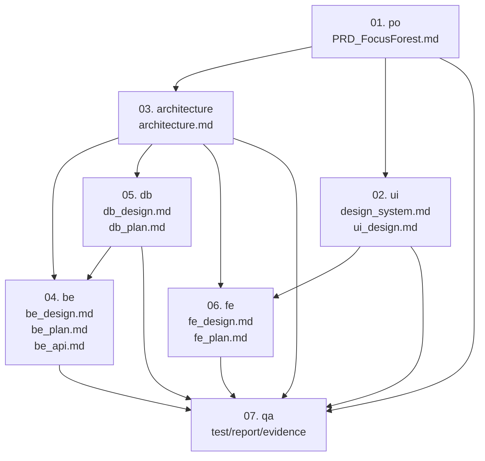

# Focus Forest v1.0 - 문서 거버넌스 가이드 (document_governance)

| 버전 | 날짜 | 작성자 | 변경 내용 |
|------|------|--------|-----------|
| v1.0 | 2026-03-12 | PO-Plan | 문서 템플릿 정규화, 참조 문서 절 추가 |

## 참조 문서
- `docs/01. po/PRD_FocusForest.md`
- `docs/03. architecture/architecture.md`
- `docs/02. ui/ui_text_definition.md`
- `docs/04. be/be_design.md`
- `docs/05. db/db_design.md`
- `docs/06. fe/fe_design.md`

---
## 1. 목적

이 문서는 Focus Forest 프로젝트의 문서 작성 순서, 문서 간 의존 관계, 정본(Source of Truth), 변경 전파 규칙을 정의한다.

문서 체계의 기본 원칙은 다음과 같다.

- `PRD`는 비즈니스 요구사항의 정본이다.
- `Architecture`는 PRD를 시스템 구조로 번역한 상위 설계 문서다.
- `BE`, `DB`, `FE`는 Architecture를 각 도메인 관점으로 상세화한 하위 설계 문서다.
- `UI`는 PRD를 화면 경험과 인터랙션으로 번역한 병렬 설계 문서다.
- `QA`는 상위 문서들을 기준으로 검증 시나리오와 품질 기준을 정의하는 파생 문서다.

---

## 2. 문서 디렉토리 구조

| 디렉토리 | 역할 |
|---|---|
| `docs/01. po/` | 요구사항, 정책, 범위, KPI, 예외처리 |
| `docs/02. ui/` | 화면 정의, 디자인 시스템, 인터랙션, 퍼블리싱 레퍼런스 |
| `docs/03. architecture/` | 시스템 전체 구조, 모듈 경계, 연동 방식, 공통 기술 원칙 |
| `docs/04. be/` | 백엔드 상세 설계, API, 인증, 동기화, 구현 계획 |
| `docs/05. db/` | ERD, 스키마, 인덱스, 무결성, 마이그레이션 계획 |
| `docs/06. fe/` | 프론트엔드 상세 설계, 상태관리, 라우팅, 구현 구조 |
| `docs/07. qa/` | 테스트 계획, 검증 결과, 결함 리포트, 증빙 |

---

## 3. 정본 문서

| 구분 | 정본 문서 | 설명 |
|---|---|---|
| 비즈니스 요구사항 | `docs/01. po/PRD_FocusForest.md` | 기능 범위, 정책, KPI, 우선순위, 예외처리의 기준 |
| 통합 아키텍처 | `docs/03. architecture/architecture.md` | PRD를 시스템 구조로 번역한 상위 설계 기준 |
| UI/UX | `docs/02. ui/design_system.md`, `docs/02. ui/ui_design.md` | 화면, 상태, 인터랙션, 시각 규칙의 기준 |
| 백엔드 | `docs/04. be/be_design.md`, `docs/04. be/be_plan.md`, `docs/04. be/be_api.md` | API, 인증, 동기화, 서버 구조의 기준 |
| 데이터베이스 | `docs/05. db/db_design.md`, `docs/05. db/db_plan.md` | 스키마, ERD, 인덱스, 데이터 정책의 기준 |
| 프론트엔드 | `docs/06. fe/fe_design.md`, `docs/06. fe/fe_plan.md` | 화면 구현 구조, 상태관리, 연동 구조의 기준 |
| 품질 검증 | `docs/07. qa/` 하위 문서 | 테스트 기준과 검증 결과의 기준 |

---

## 4. 문서 의존관계도

아래 다이어그램은 이 프로젝트의 문서 상하관계와 변경 영향 흐름을 한눈에 보여준다.



핵심 계층은 아래 한 줄로 요약한다.

`PRD -> Architecture -> BE/DB/FE`

UI는 PRD의 병렬 번역 문서이며, FE는 `Architecture`와 `UI`를 동시에 입력으로 받는다.

---


### 4.1 복사용 텍스트 의존관계도

```text
PRD
|- Architecture
|  |- BE
|  |- DB
|  |- FE
|- UI
|  `- FE
`- QA
   |- PRD 기준 검증
   |- Architecture 기준 검증
   |- UI 기준 검증
   |- BE 기준 검증
   |- DB 기준 검증
   `- FE 기준 검증
```

아래 텍스트는 문서 상하관계를 줄글로 복사할 때 사용한다.

```text
PRD
- 하위 문서: Architecture, UI
- 검증 문서: QA

Architecture
- 상위 문서: PRD
- 하위 문서: BE, DB, FE
- 검증 문서: QA

UI
- 상위 문서: PRD
- 하위 문서: FE
- 검증 문서: QA

BE
- 상위 문서: Architecture
- 검증 문서: QA

DB
- 상위 문서: Architecture
- 영향 문서: BE, QA

FE
- 상위 문서: Architecture, UI
- 검증 문서: QA
```
## 5. 권장 작성 순서

1. `docs/01. po/`의 PRD 작성 및 확정
2. `docs/03. architecture/architecture.md` 작성
3. `docs/02. ui/`의 디자인 시스템 및 화면 정의 작성
4. `docs/04. be/`의 상세 설계 및 API 문서 작성
5. `docs/05. db/`의 DB 설계 및 마이그레이션 계획 작성
6. `docs/06. fe/`의 FE 설계 문서 작성
7. `docs/07. qa/`의 검증 기준과 테스트 문서 작성

---

## 6. 변경 전파 규칙

| 변경 발생 문서 | 먼저 수정 | 반드시 따라 수정 | 조건부 검토 |
|---|---|---|---|
| PRD | PO 문서 | Architecture, UI, QA | BE, DB, FE |
| Architecture | Architecture 문서 | BE, DB, FE, QA | UI |
| UI 문서 | UI 문서 | FE, QA | PRD, Architecture |
| BE 문서 | BE 문서 | QA | Architecture, DB, FE |
| DB 문서 | DB 문서 | BE, QA | Architecture, FE |
| FE 문서 | FE 문서 | QA | UI, Architecture |
| QA 문서 | QA 문서 | 없음 | 상위 문서에 역피드백 |

---

## 7. 운영 원칙

- 상위 문서가 바뀌면 하위 문서를 맞춘다.
- 하위 문서가 상위 문서와 충돌하면 하위 문서를 수정한다.
- 기능/정책이 바뀌면 `PRD`부터 수정한다.
- 시스템 구조와 책임 경계가 바뀌면 `Architecture`부터 수정한다.
- 저장 구조가 바뀌면 `DB`부터 수정하되, 의미 변경이 있으면 `Architecture`와 `PRD`까지 역추적한다.
- 화면 흐름과 인터랙션이 바뀌면 `UI`부터 수정한다.
- 구현 방식만 바뀌고 상위 계약이 유지되면 해당 도메인 상세 문서만 수정한다.

---

## 8. 실무용 판단 기준

- 무엇을 만들지 바뀌면 `01. po`
- 어떻게 나눠 만들지 바뀌면 `03. architecture`
- 어떻게 보일지 바뀌면 `02. ui`
- 서버가 어떻게 동작할지 바뀌면 `04. be`
- 데이터가 어떻게 저장될지 바뀌면 `05. db`
- 화면이 어떻게 구현될지 바뀌면 `06. fe`
- 무엇을 검증할지 바뀌면 `07. qa`


