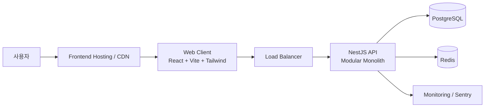
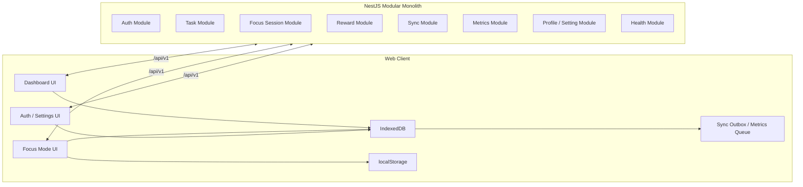

# Focus Forest 소프트웨어 아키텍처

| 버전 | 날짜 | 작성자 | 변경 내용 |
|------|------|--------|-----------|
| v1.10 | 2026-03-10 | BE-Plan | PRD v1.12 정합화 보완: 익명 KPI 이벤트 로컬 큐 및 재전송 계약 명시 |
| v2.0 | 2026-03-12 | BE-Plan | 상위 조감 문서로 재편, 중복 상세 제거, 역할별 정본 링크 허브화 |
| v2.1 | 2026-03-12 | BE-Plan | 문서 템플릿 정규화, 참조 문서 절 추가 |
| v2.2 | 2026-03-12 | BE-Plan | UI 계약 기준 V1 enum, start/bootstrap 응답 범위, conflict/dedupe/timezone 정책 고정 |
| v2.3 | 2026-03-12 | BE-Plan | Auth CSRF/429 및 Pause timeout sweeper 요약 정합화 |

## 참조 문서
- `docs/01. po/PRD_FocusForest.md`
- `docs/01. po/document_governance.md`
- `docs/04. be/be_design.md`
- `docs/05. db/db_design.md`
- `docs/06. fe/fe_design.md`

## 1. 문서 목적과 빠른 탐색

이 문서는 Focus Forest V1의 상위 통합 아키텍처 문서다. 구현 착수 시의 상세 정본(Source of Truth)은 각 도메인 문서에 있으며, 본 문서는 시스템 철학, 전체 구조, 참조 위치를 빠르게 찾기 위한 허브 역할만 수행한다.

### 1.1 정본 문서

- 백엔드 설계: [docs/04. be/be_design.md](../04. be/be_design.md)
- 백엔드 API 계약: [docs/04. be/be_api.md](../04. be/be_api.md)
- 백엔드 실행 계획: [docs/04. be/be_plan.md](../04. be/be_plan.md)
- DB 설계: [docs/05. db/db_design.md](../05. db/db_design.md)
- FE 설계: [docs/06. fe/fe_design.md](../06. fe/fe_design.md)
- PRD: [docs/01. po/PRD_FocusForest.md](../01. po/PRD_FocusForest.md)

### 1.2 빠른 탐색

- 전체 원칙과 비선택 기준: 2장
- 기술 스택과 배포 기준: 3장
- 시스템 상위 구조와 모듈 조감: 4~5장
- 핵심 정책 요약: 6장
- 역할별 정본 문서와 환경변수: 7장

### 1.3 문서 사용 원칙

- 세부 상태 머신, 동기화 규칙, 보안 정책, NFR 수치, DTO는 하위 문서를 정본으로 본다.
- 본 문서의 요약과 하위 문서가 충돌하면 하위 문서를 우선한다.
- 새 설계 상세를 추가할 때는 먼저 역할별 정본 문서를 갱신하고, 본 문서에는 링크와 요약만 남긴다.

---

## 2. 아키텍처 목표와 핵심 원칙

### 2.1 목표

1. 비로그인 상태에서도 브라우저 로컬만으로 핵심 집중 루프가 동작해야 한다.
2. 로그인 이후에는 로컬 데이터가 서버와 안전하게 동기화되어야 한다.
3. 집중 세션 보상, SP, 레벨 계산은 서버 기준으로 무결해야 한다.
4. MVP 단계에서는 모듈형 모놀리스로 빠르게 구현하고 운영한다.
5. 운영 환경의 백엔드 2 인스턴스 구성에서 Redis 기반 일관성을 보장한다.

### 2.2 핵심 원칙

- `Local-First`: 비로그인 사용자는 IndexedDB/localStorage로 핵심 기능을 지속한다.
- `Server-Authoritative After Login`: 로그인 이후 동기화 대상 데이터의 최종 권위는 서버다.
- `Layered Architecture`: `Controller -> Service -> Repository` 계층을 엄격히 분리한다.
- `Modular Monolith`: 도메인별 모듈은 분리하되 단일 NestJS 애플리케이션으로 운영한다.
- `Optimistic Concurrency`: 수정 가능한 집합은 `version`으로 충돌을 감지한다.
- `Append-Only Reward Ledger`: 보상 원장은 수정하지 않고 누적 기록한다.
- `Distributed Coordination`: idempotency, refresh token, rate limit, sync 중복 제어는 Redis를 사용한다.

### 2.3 기술적 비선택

- WebSocket: V1에서는 타이머 tick을 서버가 스트리밍하지 않는다.
- Microservice: MVP 범위와 팀 규모 기준으로 과도하다.
- Server-side timer tick: 초 단위 카운트다운은 클라이언트 로컬 시계 기준으로 계산한다.

---

## 3. 기술 스택 요약

| 영역 | 선택 | 비고 |
|------|------|------|
| Client | React + TypeScript + Vite | 반응형 웹 UI와 빠른 개발 속도 |
| UI | Tailwind CSS + Pretendard | 디자인 시스템 토큰 반영 |
| Local Storage | IndexedDB + localStorage | 구조화 데이터와 단순 UI 상태 분리 |
| Server | NestJS + TypeScript | 모듈형 모놀리스, DI, Guard, Swagger 적합 |
| ORM | Prisma | PostgreSQL 모델링과 타입 안전성 확보 |
| Database | PostgreSQL | 트랜잭션과 관계형 도메인 모델 적합 |
| Cache / Coordination | Redis | rate limit, idempotency, refresh token, sync 제어 |
| Auth | JWT Access + Refresh Token Rotation | 웹 환경 표준 인증 흐름 |
| Password Hash | Argon2id | 비밀번호 보호 강화 |
| Logging | Pino | JSON 구조화 로그 |
| Monitoring | Sentry + Health Check | 런타임 예외 추적과 운영 상태 점검 |
| Test | Jest + Supertest | 단위/통합 테스트 표준 |
| Deployment | Frontend CDN + Backend 2 Instances + Managed PostgreSQL + Managed Redis | MVP 운영 단순성과 확장성 균형 |

### 3.1 배포 환경 기준

- Development: 로컬 FE + 로컬/도커 BE + 로컬 PostgreSQL/Redis
- Staging: 단일 또는 2 인스턴스 백엔드 + Managed PostgreSQL/Redis
- Production(MVP): 백엔드 2 인스턴스, Managed PostgreSQL, Managed Redis, HTTPS 필수

---

## 4. 시스템 컨텍스트

### 4.1 시스템 경계

- 클라이언트는 로컬 저장소를 1차 작업 공간으로 사용한다.
- 로그인 후 서버는 Task, Session, Reward, Profile, Sync의 최종 상태를 관리한다.
- Redis는 멀티 인스턴스 운영에서 분산 일관성을 담당한다.
- KPI 이벤트 수집은 핵심 동기화와 분리된 경량 수집 경로로 처리한다.

---

## 5. 컴포넌트 아키텍처 요약

### 5.1 서버 모듈 책임

- `Auth`: 회원가입, 로그인, refresh rotation, 로그아웃, Guard
- `Task`: Task CRUD, 핵심 과제 지정, 완료/활성 상태 가드
- `Focus Session`: 시작, Pause, Resume, Complete, Give Up, Break 상태 전이
- `Reward`: SP 적립, RewardLedger, DailyFocusStat, UserProgressSnapshot 갱신
- `Sync`: bootstrap, push, pull, 충돌 처리, outbox 반영
- `Metrics`: KPI 이벤트 수집, 익명/로그인 이벤트 중복 방지
- `Profile / Setting`: 프로필, 테마, 타임존, 동기화 설정
- `Health`: liveness/readiness 점검

### 5.2 모듈 의존 규칙

- `Session -> Reward` 단방향 의존만 허용한다.
- `Sync`는 `Task`, `Session`, `Profile/Setting`을 호출할 수 있으나 역의존은 금지한다.
- 다른 모듈의 `Repository` 직접 호출보다 `Service` 또는 명시적 Query Port를 우선한다.

---

## 6. 핵심 정책 요약

### 6.1 저장 전략

- 비로그인 사용자의 핵심 루프 데이터는 클라이언트 로컬에 저장한다.
- 로그인 사용자의 Task, FocusSession, RewardLedger, DailyFocusStat, UserProgressSnapshot, ProductMetricEvent, Profile/Setting은 서버 영속화 대상이다.
- UI 전용 뷰 상태와 단순 설정은 로컬 전용으로 유지할 수 있다.
- Task 저장 enum의 V1 범위는 `PENDING`, `COMPLETED`만 사용한다. UI의 `진행중` 필터는 활성 `FocusSession` 연결 여부로 파생한다.
- `UserProgressSnapshot`의 V1 범위는 `totalSp`, `currentLevel`, `totalCompletedSessions`까지만 포함하며, streak는 V1 범위 밖이다.

### 6.2 동기화 정책

- 로그인 상태이고 온라인이면 상태 전이 이벤트는 즉시 API를 호출한다.
- 실패 시 Sync Outbox에 적재하고 복구 시 재시도한다.
- 로그인 직후 bootstrap은 `clientGeneratedId` 기준으로 병합한다.
- bootstrap 성공 응답은 후속 대시보드 재조회 없이 화면 진입을 결정할 수 있는 render-ready snapshot만 반환한다. 포함 범위는 `tasks`, `activeSession?`, `dashboardSummary`, `rewardSnapshot`, `profile`, `setting`, `syncState`, `cursor`이며, 원장/히스토리 전체는 제외한다.
- 충돌 검출은 `updatedAt`이 아니라 `version`을 기준으로 수행한다.
- `409 Conflict`는 공통 payload로 `entityType`, `entityId`, `clientVersion?`, `serverVersion`, `serverSnapshot`, `conflictFields?`, `resolutionStrategy`, `retryable`를 반환한다.
- 상세 bootstrap, push/pull, conflict 계약은 [docs/04. be/be_design.md](../04. be/be_design.md)와 [docs/04. be/be_api.md](../04. be/be_api.md)를 따른다.

### 6.3 세션/보상 정책

- 집중 세션은 완료된 Task에서 시작할 수 없고, 사용자당 활성 세션은 1개만 허용한다.
- Pause는 세션당 최대 1회, 최대 5분이다.
- Pause timeout 강제는 요청 시점 재검증과 1분 주기 sweeper를 함께 사용하며, 상세 규칙은 [docs/04. be/be_design.md](../04. be/be_design.md)를 따른다.
- `startFocusSession` 성공 응답은 집중 화면 즉시 진입에 필요한 `activeSession`, `currentTask`, `sidebarSummary`, `nextTaskCandidates(max 2)`, `policy`만 포함한다.
- 표준 뽀모도로 UX는 `complete -> start-break -> complete-break/skip-break` 호출 체인으로 구성한다.
- 보상 정산은 세션 완료 트랜잭션 안에서 `RewardLedger`, `DailyFocusStat`, `UserProgressSnapshot`을 함께 갱신한다.

### 6.4 KPI / Metrics 정책

- KPI 이벤트 수집 경로는 `POST /api/v1/metrics/events`다.
- 비로그인 이벤트는 인증 동기화 outbox와 분리된 로컬 metrics queue에 적재 후 재전송한다.
- 서버는 전송 멱등성을 위해 `eventId`를 unique하게 처리하고, 의미 중복 방지를 위해 `eventName + dedupeKey`를 추가 적용한다.
- `APP_FIRST_OPEN`, `AUTH_SIGNUP_SUCCESS`, `FOCUS_SESSION_COMPLETED`, `REWARD_GRANTED_FIRST_TIME`는 고정 `dedupeKey`를 사용하고, `AUTH_LOGIN_SUCCESS`, `DASHBOARD_TASK_SET`은 개별 발생을 허용하되 `eventId` 기준으로만 중복을 제거한다.

### 6.5 보안 및 운영 정책

- Access Token은 브라우저 메모리 전용, Refresh Token은 HttpOnly Secure Cookie를 사용한다.
- `signup`, `login`, `refresh` 성공 시 서버는 `refreshToken` HttpOnly Cookie와 `csrfToken` Cookie를 함께 발급/회전하고, `auth/refresh`, `auth/logout`는 CSRF double-submit 검증을 적용한다.
- 운영 환경의 rate limit, refresh token, idempotency, sync 중복 제어는 Redis를 필수 사용한다.
- Auth rate limit 초과는 `AUTH_429_RATE_LIMIT`, Sync/Metrics rate limit 초과는 `SYNC_429_RATE_LIMIT`을 사용한다.
- timezone 변경 시 과거 `DailyFocusStat`/UI `DailySummary`를 소급 재집계하지 않는다. 변경 이후 완료 세션부터 새 timezone 기준을 적용한다.
- 상세 보안/NFR/운영 기준은 [docs/04. be/be_design.md](../04. be/be_design.md)와 [docs/04. be/be_plan.md](../04. be/be_plan.md)를 따른다.

### 6.6 V1 제외 범위

- `Task.status`의 추가 저장 enum(`IN_PROGRESS` 등) 도입
- bootstrap 응답에 reward ledger/history 전체 포함
- 서버 측 manual merge 또는 conflict 자동 병합
- timezone 변경 시 과거 일자 재집계/backfill 배치
- streak 집계 및 streak 기반 보상/노출

---

## 7. 역할별 정본 문서와 환경변수

### 7.1 역할별 정본 문서

| 역할 | 정본 문서 | 용도 |
|------|-----------|------|
| BE-Plan / BE-Act | [docs/04. be/be_design.md](../04. be/be_design.md) | 백엔드 아키텍처, 상태 머신, 보안, 운영 기준 |
| FE-Plan / FE-Act | [docs/06. fe/fe_design.md](../06. fe/fe_design.md) | 클라이언트 저장 전략, 화면 상태, 동기화 UX |
| DB-Plan / DB-Act | [docs/05. db/db_design.md](../05. db/db_design.md) | 엔터티, 제약조건, 인덱스, ERD |
| API 연동 | [docs/04. be/be_api.md](../04. be/be_api.md) | 요청/응답 DTO, 오류 코드, 엔드포인트 계약 |
| 구현 순서 / 핸드오프 | [docs/04. be/be_plan.md](../04. be/be_plan.md) | 구현 Phase, 체크리스트, 환경변수, 테스트 전략 |

### 7.2 환경변수 기준

아래 키는 `.env.example`에 포함해야 하는 최소 목록이며, 정본 표는 [docs/04. be/be_plan.md](../04. be/be_plan.md) 2절을 따른다.

| 키 | 설명 |
|----|------|
| `NODE_ENV`, `APP_VERSION`, `PORT` | 실행 환경과 배포 식별자 |
| `DATABASE_URL`, `REDIS_URL` | PostgreSQL / Redis 연결 정보 |
| `JWT_ACCESS_SECRET`, `JWT_REFRESH_SECRET` | 토큰 서명 키 |
| `ACCESS_TOKEN_TTL`, `REFRESH_TOKEN_TTL` | 토큰 만료 정책 |
| `AUTH_RATE_LIMIT_MAX`, `AUTH_RATE_LIMIT_WINDOW_SEC` | 인증 Rate Limiting |
| `METRICS_RATE_LIMIT_MAX`, `METRICS_RATE_LIMIT_WINDOW_SEC` | KPI 이벤트 수집 Rate Limiting |
| `SYNC_RATE_LIMIT_MAX`, `SYNC_RATE_LIMIT_WINDOW_SEC` | 동기화 Rate Limiting |
| `ARGON2_MEMORY_COST`, `ARGON2_TIME_COST`, `ARGON2_PARALLELISM` | 비밀번호 해시 설정 |
| `CORS_ORIGINS`, `LOG_LEVEL`, `IDEMPOTENCY_TTL_SEC`, `SENTRY_DSN` | 운영/보안/관측 설정 |

### 7.3 다음 단계

- BE 상세 설계와 구현 계획은 `docs/04. be/` 문서 3종을 기준으로 진행한다.
- DB 세부 모델링과 인덱스 설계는 `docs/05. db/db_design.md`에서 이어간다.
- FE 화면/상태 설계는 `docs/06. fe/fe_design.md`를 기준으로 진행한다.
