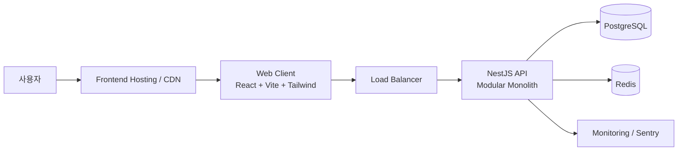
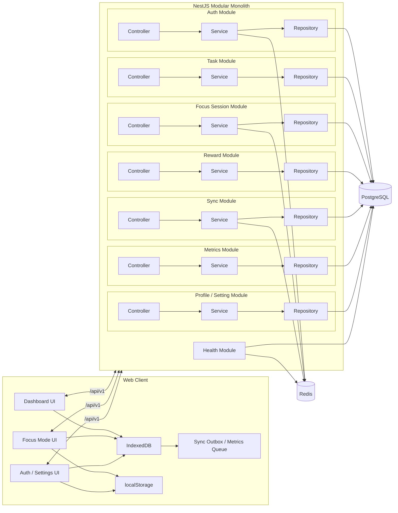
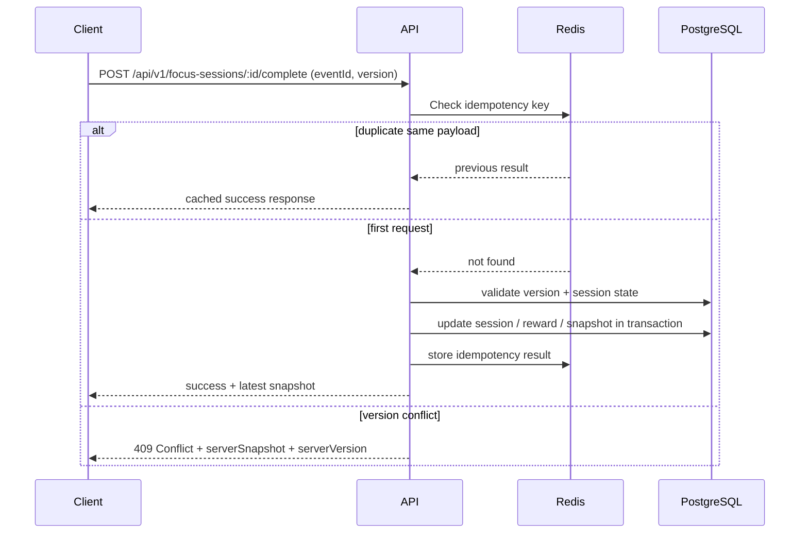
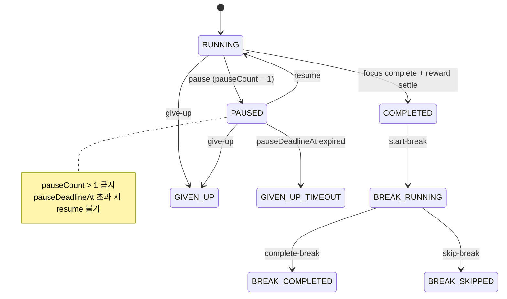
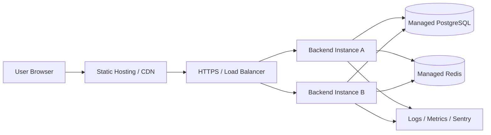

# Focus Forest V1 — 백엔드 아키텍처 설계 (be_design)

| 버전 | 날짜 | 작성자 | 변경 내용 |
|------|------|--------|-----------|
| v1.0 | 2026-03-10 | BE-Plan | architecture.md v1.3 분리 |
| v1.1 | 2026-03-10 | BE-Plan | 세션 시작 가드, break 종료 계약, idempotency 범위 보강 |
| v1.2 | 2026-03-12 | BE-Plan | UI 계약 기준 V1 enum, start/bootstrap 응답 범위, conflict/dedupe/timezone 정책 확정 |
| v1.3 | 2026-03-12 | BE-Plan | Auth 429/CSRF 전달 경로, Pause timeout sweeper 권위 문서화 |

## 참조 문서

- PRD: docs/01. po/PRD_FocusForest.md
- API 명세: docs/04. be/be_api.md
- DB 설계: docs/05. db/db_design.md
- FE 설계: docs/06. fe/fe_design.md
- BE 가이드: .agents/standards/BE_GUIDE.md

---

## 1. 문서 목적

본 문서는 Focus Forest V1 백엔드의 아키텍처 설계 명세를 정의한다. 아키텍처, 다이어그램, 상태 머신, 보안 정책, 동기화 전략, 비기능 요구사항 등 "무엇을 어떻게 만들 것인가"에 해당하는 설계 결정을 포함한다.

### 1.1 화면-BE 책임 연결

UI 레퍼런스와 PRD 기준으로 V1의 핵심 화면 그룹은 아래 세 축으로 정리된다.

- 대시보드: 할 일 목록, 오늘 통계, 현재 핵심 과제, 보상 요약
- 집중 화면: 타이머, Pause, Give Up, 세션 완료, 휴식 Skip
- 인증/설정 화면: 회원가입, 로그인, 로컬 모드, 프로필, 테마/동기화 설정

따라서 백엔드는 아래 세 가지를 반드시 보장해야 한다.

- 대시보드가 즉시 그릴 수 있는 저지연 조회 API와 통계 스냅샷
- 집중 화면 상태 전환에 대한 무결성 보장과 중복 처리 방지
- 로컬 우선(Local-First) 사용 경험과 로그인 이후 멀티 디바이스 동기화

---

## 2. 아키텍처 목표와 원칙

### 2.1 목표

1. 비로그인 상태에서도 브라우저 로컬만으로 핵심 기능이 동작해야 한다.
2. 로그인 이후에는 로컬 데이터가 서버와 안전하게 동기화되어야 한다.
3. 집중 세션 보상, SP, 레벨 계산은 서버 기준으로 무결해야 한다.
4. MVP 단계에서는 마이크로서비스가 아니라 **모듈형 모놀리스**로 빠르게 구현하고 운영한다.
5. 운영 환경의 백엔드 2 인스턴스 구성에서 Redis 기반 일관성을 보장한다.

### 2.2 핵심 원칙

- **Local-First**: 비로그인 사용자는 IndexedDB/localStorage를 단일 저장소로 사용한다.
- **Server-Authoritative After Login**: 로그인 이후 동기화 대상 데이터의 최종 권위는 서버가 가진다.
- **Layered Architecture**: `Controller -> Service -> Repository` 계층을 엄격히 분리한다.
- **Modular Monolith**: 도메인별 모듈을 분리하되 단일 NestJS 애플리케이션으로 운영한다.
- **Optimistic Concurrency**: 수정 가능한 집합은 `version` 기반 낙관적 잠금으로 충돌을 감지한다.
- **Append-Only Reward Ledger**: 보상 원장은 수정하지 않고 누적 기록한다.
- **Distributed Coordination**: 운영 환경에서는 idempotency, refresh token, rate limiting을 Redis로 통합한다.

---

## 3. 기술 스택 (서버 측)

### 3.1 선정 테이블

| 영역 | 선택 | 이유 |
|------|------|------|
| Server | NestJS + TypeScript | 모듈형 모놀리스, DI, Guard, Validation, Swagger에 적합 |
| ORM | Prisma | PostgreSQL 모델링, 마이그레이션, 타입 안전성 확보 |
| Database | PostgreSQL | 트랜잭션, 인덱스, 관계형 도메인 모델에 적합 |
| Cache / Coordination | Redis | 멀티 인스턴스 환경의 rate limit, idempotency, refresh token, sync 중복 방지 |
| Auth | JWT Access Token + Refresh Token Rotation | 웹 환경에서 표준적이며 단기 액세스 토큰과 장기 세션 분리 가능 |
| Password Hash | Argon2id | 메모리 하드 해시로 비밀번호 보호 강화 |
| Logging | Pino | JSON 구조화 로그와 성능에 적합 |
| Monitoring | Sentry + Health Check | 런타임 예외 추적과 배포 상태 점검 |
| Test | Jest + Supertest | Service 단위 테스트와 API 통합 테스트 용이 |
| Deployment | Backend 2 Instances + Managed PostgreSQL + Managed Redis | MVP 단계의 운영 단순성과 확장성 균형 |

### 3.2 기술적 비선택

- WebSocket: V1에서는 타이머 자체를 서버 스트리밍하지 않으므로 도입하지 않는다.
- Microservice: 도메인 규모와 팀 규모 기준으로 과도하다.
- Server-side timer tick: 집중 카운트다운은 클라이언트 로컬 시계 기준으로 처리한다.

---

## 4. 시스템 컨텍스트

### 4.1 다이어그램



### 4.2 배포 환경 기준

- Development: 로컬 FE + 로컬/도커 BE + 로컬 PostgreSQL/Redis
- Staging: 단일 또는 2 인스턴스 백엔드 + Managed PostgreSQL/Redis
- Production(MVP): 백엔드 2 인스턴스, Managed PostgreSQL, Managed Redis, HTTPS 필수

---

## 5. 컴포넌트 아키텍처

### 5.1 다이어그램



### 5.2 모듈 책임

#### Auth Module

- 회원가입, 로그인, 로그아웃, 토큰 재발급
- Access/Refresh 토큰 발급 및 rotation
- `refreshToken` HttpOnly Cookie와 `csrfToken` Cookie 발급/회전/폐기
- Refresh token 해시 저장 및 revocation
- Guard 전략, 인증 실패 코드 표준화

#### Task Module

- Task CRUD
- 핵심 과제 지정, 완료 상태 전환
- `Task.status` 저장 enum은 V1에서 `PENDING`, `COMPLETED`만 허용한다. UI의 `진행중` 필터는 활성 세션 연결 여부로 계산한다.
- 완료된 Task의 집중 시작 및 핵심 과제 재지정 차단 (`TASK_409_COMPLETED`)
- 진행 중 세션이 연결된 Task의 수정/삭제 차단

#### Focus Session Module

- 집중 세션 시작, Pause, Resume, Give Up, Complete, Start Break, Complete Break, Skip Break
- 동일 사용자당 활성 세션 1개 제한 (`RUNNING`, `PAUSED`, `BREAK_RUNNING`)
- Pause 최대 1회 / 5분 제한 정책
- Pause timeout sweeper를 통한 `GIVEN_UP_TIMEOUT` 상태 마킹
- 세션 시작 성공 시 집중 화면 즉시 진입용 `activeSession`, `currentTask`, `sidebarSummary`, `nextTaskCandidates(max 2)`, `policy` 반환
- 세션 상태 전환의 idempotency 보장
- 보상 지급을 위한 Reward Module 호출 트리거

#### Reward Module

- SP 적립, 보상 원장 기록, 오늘의 나무/총 SP/레벨 계산
- `DailyFocusStat`, `UserProgressSnapshot` 업데이트

#### Sync Module

- 로그인 시 bootstrap 병합
- push/pull 기반 delta 동기화
- bootstrap 성공 시 후속 대시보드 재조회 없이 사용할 render-ready snapshot 반환
- 충돌 감지, cursor 관리, outbox 재처리
- 중복 요청 방지를 위한 Redis coordination

#### Metrics Module

- `POST /api/v1/metrics/events` 수집
- `eventId` 멱등성과 `eventName + dedupeKey` 의미 중복 방지
- 익명/로그인 이벤트의 owner scope 구분과 dedupeKey 정규화
- V1 KPI 원장 저장만 담당하고 고급 분석 집계는 제외

#### Profile / Setting Module

- 프로필 조회/수정
- 테마, 타임존, 동기화 설정, 로컬 모드 관련 설정 저장
- 익명 사용자 설정의 로그인 후 승격 정책 반영

#### Health Module

- `/health/live`
- `/health/ready`

### 5.3 모듈 간 의존 방향 규칙

- `SessionModule -> RewardModule` 단방향 의존만 허용한다. RewardModule의 역방향 의존은 금지한다.
- `SyncModule`은 bootstrap/push/pull 조합을 위해 `TaskService`, `SessionService`, `Profile/SettingService`를 호출할 수 있으나, 각 도메인 모듈이 `SyncModule`에 역의존하는 것은 금지한다.
- 모듈 간 데이터 접근은 다른 모듈의 `Repository` 직접 호출보다 `Service` 또는 명시적 Query Port를 우선한다.
- NestJS `forwardRef`는 예외적 상황에서만 허용하며, 기본 원칙은 순환 의존이 없는 단방향 모듈 그래프다.

---

## 6. 서버 데이터 경계

### 6.1 서버 영속화 대상 (-> db_design.md 참조)

로그인 사용자에 대해 서버는 아래 데이터를 영속 보관한다. 상세 스키마와 ERD는 `docs/05. db/db_design.md`를 참조한다.

- 사용자 계정 및 인증 정보
- Task
- Focus Session
- Reward Ledger
- DailyFocusStat
- UserProgressSnapshot
- ProductMetricEvent
- UserSetting / Profile
- Refresh Token 메타데이터
- Sync Cursor / Device Sync Metadata

---

## 7. 동기화 아키텍처

### 7.1 실시간 동기화 정의

PRD의 "실시간 동기화"는 V1에서 아래 의미로 정의한다.

- 사용자가 **로그인 상태이고 온라인이면** Task CRUD, 세션 상태 전환, 프로필/설정 변경 시 **즉시 API를 호출**한다.
- 호출이 성공하면 로컬 캐시를 서버 응답 기준으로 갱신한다.
- 호출이 실패하면 변경 이벤트를 Sync Outbox에 적재하고, 네트워크 복구 또는 사용자의 수동 동기화 시 재시도한다.
- **타이머 카운트다운 자체는 서버와 실시간 동기화하지 않는다.** 서버는 세션 시작/중단/완료 시점과 정책 검증만 담당한다.

즉, V1의 실시간 동기화는 "상태 전이 이벤트는 즉시 서버 반영, 초 단위 카운트다운은 로컬 처리"로 정의한다.

### 7.2 bootstrap 병합 규칙

로그인 성공 후 클라이언트는 `POST /api/v1/sync/bootstrap`을 호출하여 로컬 데이터와 서버 데이터를 병합한다.

병합 기준은 아래와 같다.

- 모든 로컬 생성 엔터티는 생성 시점에 `clientGeneratedId`(UUIDv7)를 부여한다.
- 서버에 동일한 `clientGeneratedId`가 이미 있으면 **서버 레코드를 우선** 채택하고, 클라이언트는 로컬 임시 ID를 서버 ID로 매핑한다.
- 서버에 없는 로컬 레코드는 서버에 신규 삽입한다.
- 서버에만 존재하는 레코드는 클라이언트로 pull 한다.
- 동일 Task의 의미상 중복 여부는 자연어 제목이 아니라 `clientGeneratedId`와 서버 ID를 기준으로 판단한다.
- 로컬에서 완료된 `FocusSession`은 서버가 그대로 신뢰하지 않는다. 클라이언트는 세션 사실값(`startedAt`, `endedAt`, `status`, `pauseCount`, `clientGeneratedId`)만 전송하고, 서버가 보상 지급 가능 여부와 SP/레벨 반영을 **재검증 및 재정산**한다.
- 따라서 bootstrap 시 로컬 집계값(`총 SP`, `레벨`, `오늘의 나무`)은 서버에 직접 반영하지 않으며, RewardModule이 세션 사실값 기준으로 재구성한다.
- bootstrap은 대용량 단일 요청으로 보내지 않는다. 클라이언트는 **배치 단위 분할 전송**을 사용하며, 기본 권고치는 `Task 100건 + FocusSession 100건` 이하 또는 요청 본문 `1MB` 이하이다.
- bootstrap 배치는 여러 번 재시도될 수 있으며, 중복 삽입 방지는 `clientGeneratedId` unique 제약과 서버 병합 규칙으로 처리한다.
- UUIDv7 충돌 확률은 V1에서 허용 가능한 범위로 간주한다. 이론적 충돌이 발생하면 기존 규칙대로 **서버 레코드를 채택**한다.
- bootstrap 성공 응답은 `tasks`, `activeSession?`, `dashboardSummary`, `rewardSnapshot`, `profile`, `setting`, `syncState`, `cursor`만 포함한다.
- reward ledger/history 전체, manual merge 초안, metrics 원장 전체 다운로드는 bootstrap V1 응답 범위에서 제외한다.

### 7.3 push/pull 프로토콜

- `push`: 로컬 outbox의 변경 이벤트를 서버에 업로드한다.
- `pull`: 마지막 `cursor` 이후 변경된 서버 데이터를 내려받는다.
- `pull` 응답은 bootstrap과 동일한 read-model vocabulary를 유지한다. 즉 `rewardSnapshot`, `syncState`, `activeSession?`를 사용하고, 필요 시 `sessions` delta를 함께 포함한다.
- `cursor`는 사용자별 동기화 기준점으로 사용하며, 서버는 delta 응답과 함께 최신 cursor를 반환한다.
- 수동 동기화 버튼은 결국 동일한 bootstrap/push/pull 흐름을 트리거한다.
- outbox 이벤트는 디바이스별 단조 증가 값 `deviceSequence`로 순서를 보장한다. `occurredAt`은 보조 정렬/감사 용도다.
- 서버는 동일 디바이스 배치 내 이벤트를 `deviceSequence` 오름차순으로 적용한다.
- 같은 mutable 엔터티(Task, Profile, Setting)에 대한 연속 수정은 클라이언트가 push 전에 **최종 상태로 coalesce**할 수 있다. 반면 세션 완료/포기/휴식 Skip처럼 의미가 있는 상태 전이는 개별 이벤트를 유지한다.
- 오프라인 기기에서 누적된 이벤트 중 특정 엔터티가 `409 Conflict`를 받으면, 해당 엔터티의 stale outbox 이벤트는 폐기하고 `serverSnapshot`으로 로컬을 교체한다. 사용자가 원하면 최신 스냅샷 기준으로 다시 수정하여 새 이벤트를 생성한다.

### 7.4 동기화 시퀀스 다이어그램



---

## 8. 세션/보상 시스템 설계

### 8.1 세션 시작 사전 검증

- `POST /api/v1/focus-sessions`는 아래 조건을 모두 검증해야 한다.
  - 요청한 `taskId`가 현재 사용자 소유이며 최신 `taskVersion`과 일치할 것
  - Task 상태가 `COMPLETED`가 아닐 것
  - 동일 사용자에게 `RUNNING`, `PAUSED`, `BREAK_RUNNING` 상태의 활성 세션이 없을 것
- 완료된 Task로 집중을 시작하려는 요청은 `TASK_409_COMPLETED`로 거절한다.
- 동일 사용자에게 이미 활성 세션이 존재하면 `SESSION_409_ALREADY_RUNNING`을 반환한다.
- Task의 `version`이 오래된 경우에는 `SYNC_409_CONFLICT`와 최신 `serverSnapshot`을 반환한다.
- 성공 응답은 집중 화면 진입에 필요한 최소 범위만 포함한다.
  - `activeSession`: `focusSessionId`, `taskId`, `status`, `startedAt`, `plannedFocusSec`, `pauseCount`, `version`
  - `currentTask`: `taskId`, `title`, `status`, `isCore`, `isLocked`
  - `sidebarSummary`: `completedFocusSessionCount`
  - `nextTaskCandidates`: 최대 2건, `COMPLETED` 제외
  - `policy`: `focusDurationSec=1500`, `breakDurationSec=300`, `pauseLimitSec=300`, `maxPauseCount=1`
- 대시보드 전체 task list, reward ledger, profile/settings 전체 스냅샷은 `startFocusSession` 응답 범위에 포함하지 않는다.

### 8.2 Pause 정책 (상태 머신 다이어그램 포함)

Pause 정책은 클라이언트와 서버가 함께 책임지는 **하이브리드 모델**로 정의한다.

1. PRD 기준으로 Pause는 **집중 세션당 최대 1회**만 허용한다.
2. 클라이언트는 Pause 진입 즉시 `pauseStartedAt`, `pauseDeadlineAt`, `pauseCount=1`을 로컬에 저장하고, 온라인이면 즉시 `PATCH /api/v1/focus-sessions/:id/pause`를 호출한다.
3. 서버는 세션 레코드에 `pauseStartedAt`, `pauseDeadlineAt`, `pauseCount`, `status=PAUSED`를 저장한다.
4. 서버는 두 번째 Pause 요청을 받으면 `SESSION_409_PAUSE_LIMIT`으로 거절한다. 따라서 클라이언트 우회 호출로도 정책을 깨지 못한다.
5. 클라이언트가 활성 상태라면 `pauseDeadlineAt` 도달 시 자동으로 give-up 처리 UI를 수행하고, 온라인이면 `POST /api/v1/focus-sessions/:id/give-up`를 호출한다. 오프라인이면 로컬 상태를 `GIVEN_UP_TIMEOUT`으로 마킹한 뒤 재연결 시 동기화한다.
6. 서버는 `resume`, `complete`, `pull`, `push` 요청 시 `pauseDeadlineAt` 초과 여부를 다시 검증하는 on-request lazy validation을 수행한다.
7. 운영 환경에서는 `NestJS ScheduleModule` 기반 1분 주기 Pause timeout sweeper를 함께 운용한다. sweeper는 Redis 분산 락(`lock:focus-session-timeout-sweeper`)을 획득한 단일 인스턴스에서만 실행된다.
8. sweeper는 `WHERE status = 'PAUSED' AND pauseDeadlineAt < now()` 조건을 만족하는 세션을 `GIVEN_UP_TIMEOUT`으로 상태 마킹만 하며, 보상 지급이나 알림 발송 같은 부수 효과는 수행하지 않는다.

> 비즈니스 정책값(집중 25분, 휴식 5분, Pause 상한 5분 등)은 PRD 3.2절 참조. 서버는 해당 값을 환경 설정 또는 상수로 관리하며 정책 검증 시 사용한다.



### 8.3 세션 완료와 보상 지급

- 세션 `complete`는 트랜잭션으로 처리한다.
- 처리 순서:
  1. 세션 상태 검증
  2. 보상 지급 가능 여부 검증
  3. Focus Session 상태 `COMPLETED` 갱신
  4. Reward Ledger append
  5. `DailyFocusStat`, `UserProgressSnapshot` 갱신
  6. 최신 통계 스냅샷 반환
- 트랜잭션이 실패하면 전체 롤백하며, 클라이언트는 동일 `eventId`로 재시도할 수 있다.
- `RewardLedger`는 `sourceSessionId` unique 제약으로 중복 보상 지급을 방지한다.
- PostgreSQL 트랜잭션은 `Session 상태 갱신 + Reward Ledger append + Stat/Snapshot 갱신`을 원자적으로 포함해야 한다.
- `complete`는 집중 세션의 보상 정산까지를 담당하며, 표준 뽀모도로 UX에서는 FE가 성공 응답 직후 `start-break`를 자동 호출한다.

> SP 지급량, 레벨 공식 등 보상 정책 상세는 PRD 3.2절 참조. 서버는 해당 공식을 서비스 계층에 구현하여 트랜잭션 내에서 적용한다.

### 8.4 Break 시작 및 종료 정책

- `start-break`의 허용 선행 상태는 `COMPLETED`뿐이다.
- 표준 UX에서는 `complete` 성공 후 FE가 `start-break`를 즉시 호출해 사용자에게 25분 집중 + 5분 휴식이 끊김 없이 이어지도록 한다.
- `complete-break`는 휴식 타이머가 `00:00`에 도달했을 때 FE가 호출하며, 상태를 `BREAK_RUNNING -> BREAK_COMPLETED`로 전이한다.
- `skip-break`의 허용 선행 상태는 `BREAK_RUNNING`뿐이다.
- 집중 세션 중에는 `Skip`을 제공하지 않는다.
- `start-break`, `complete-break`, `skip-break`는 현재 상태에서 허용되지 않으면 `SESSION_409_INVALID_STATE`를 반환한다.
- 동일 휴식 세션에 대한 중복 `complete-break`, `skip-break`는 idempotency key로 막는다.

---

## 9. 충돌 처리와 동기화 일관성

### 9.1 기준 필드 선택

- **권위 있는 충돌 검출 필드**는 `version`이다.
- `updatedAt`은 감사(audit) 및 정렬 용도로만 사용한다.
- Task, FocusSession, Profile, UserSetting 등 수정 가능한 집합은 `version` 컬럼을 가진다.

### 9.2 충돌 처리 전략

- 서버는 `PATCH` 또는 `sync/push` 요청에서 현재 `version`을 검증한다.
- 요청의 `version`이 서버의 최신 값과 다르면 `409 Conflict`를 반환한다.
- 충돌 시 서버는 아래 정보를 함께 반환한다.
  - `entityType`
  - `entityId`
  - `clientVersion` (있을 때만)
  - `serverVersion`
  - `serverSnapshot`
  - `conflictFields` (선택)
  - `resolutionStrategy = REPLACE_LOCAL_WITH_SERVER`
  - `retryable = false`
- V1은 **manual merge UI를 제공하지 않는다.**
- 클라이언트는 `409` 수신 시 로컬 엔터티를 `serverSnapshot`으로 교체하고, 사용자에게 "다른 기기 변경 사항이 반영되었습니다" 수준의 안내를 보여준다.
- 재수정은 최신 스냅샷 기준으로 사용자가 다시 수행한다.
- `sync/push`의 `rejected[]`와 bootstrap 충돌 응답도 동일한 payload shape를 사용한다.

즉, V1의 충돌 정책은 **version 기반 검출 + server snapshot replacement**이다.

### 9.3 bootstrap 병합 규칙

| 상황 | 규칙 |
|------|------|
| 동일 `clientGeneratedId`가 서버에 존재 | 서버 레코드 채택, 클라이언트 로컬 ID remap |
| 로컬에만 존재 | 서버 신규 삽입 |
| 서버에만 존재 | 클라이언트로 pull |
| 동일 엔터티를 다중 기기에서 수정 | 더 최신 서버 `version` 보유 레코드가 기준, 충돌 시 409 |

### 9.4 append-only 대상

아래 데이터는 수정보다 추가를 우선하는 append-only 모델을 사용한다.

- Reward Ledger
- 동기화 이벤트 로그(선택 도입)
- 세션 상태 전이 이력(별도 이벤트 테이블 도입 시)

---

## 10. 분산 일관성 설계

### 10.1 idempotency key 전략

- 생성 주체: 클라이언트
- 형식: UUIDv7 `eventId`
- Redis 키 구조:

```text
idem:{userId}:{resourceType}:{resourceId}:{action}:{eventId}

```

- TTL: 기본 7일 (`IDEMPOTENCY_TTL_SEC=604800`)
- 동일 key + 동일 payload: 이전 성공/실패 결과를 그대로 반환
- 동일 key + 다른 payload: `409 Conflict`

적용 대상:

- `focus-sessions/:id/complete`
- `focus-sessions/:id/give-up`
- `focus-sessions/:id/start-break`
- `focus-sessions/:id/complete-break`
- `focus-sessions/:id/skip-break`
- 보상 정산 처리
- `sync/push`

### 10.2 refresh token rotation / revocation

- `POST /api/v1/auth/refresh` 호출 시 refresh token rotation을 수행한다.
- 새 refresh token 발급 후 이전 token은 즉시 revoke 한다.
- 로그아웃 시 현재 refresh token을 Redis 또는 영속 저장소에서 제거한다.
- refresh token은 원문 저장이 아니라 해시 또는 식별 가능한 안전한 메타데이터 형태로 저장한다.
- 운영 환경에서는 refresh token store를 인메모리로 대체하지 않는다.
- Refresh Token Reuse Detection(탈취 감지)은 V1에서 구현 보류하며, V2 보안 강화 단계에서 token family 정책으로 확장 검토한다.

### 10.3 Redis 의무 사용 범위

운영 환경 2 인스턴스 구성에서 Redis는 아래 기능에 **필수**다.

- rate limiting 카운터
- refresh token 저장/회전/폐기
- idempotency key 저장
- sync 중복 처리 방지

따라서 운영 환경에서 위 기능을 인메모리 캐시로 구현하는 것은 금지한다.

### 10.4 KPI dedupe 기준

- 전송 멱등성 1차 기준은 `eventId(UUIDv7)` unique다.
- 의미 중복 방지 2차 기준은 `eventName + dedupeKey`다.
- 클라이언트는 metrics queue에 `dedupeKey`를 저장해 재시도 시 동일 값을 유지한다.
- 이벤트별 V1 dedupeKey 기준은 아래와 같다.
  - `APP_FIRST_OPEN`: `install:{deviceId}:app_first_open`
  - `AUTH_SIGNUP_SUCCESS`: `user:{userId}:auth_signup_success`
  - `FOCUS_SESSION_COMPLETED`: `focusSession:{focusSessionId}:focus_session_completed`
  - `REWARD_GRANTED_FIRST_TIME`: `user:{userId}:reward_granted_first_time`
- `AUTH_LOGIN_SUCCESS`, `DASHBOARD_TASK_SET`은 개별 발생 자체가 의미 있으므로 `eventId` 기준으로만 중복을 제거한다.
- `occurredAt`은 정렬/감사 용도이며 dedupe 기준 필드로 사용하지 않는다.

---

## 11. 통계/파생 뷰 설계

### 11.1 파생 뷰 모델

서버는 대시보드 성능과 일관성을 위해 아래 파생 뷰를 유지한다.

- `UserProgressSnapshot`: 총 SP, 현재 레벨, 총 완료 세션 수
- `DailyFocusStat`: 날짜별 집중 시간, 오늘 완료 세션 수, 오늘 심은 나무 수. UI `DailySummary`는 이 read model을 기준으로 조회한다.

### 11.2 업데이트 시점

- 세션 완료 트랜잭션 안에서 `RewardLedger`, `DailyFocusStat`, `UserProgressSnapshot`을 함께 갱신한다.
- 레벨 계산과 SP 지급 공식은 PRD 3.2절 참조. 서버는 해당 공식을 트랜잭션 내에서 적용한다.
- streak 계산/저장은 V1 범위에서 제외한다.

### 11.3 일일 리셋 정책

- "오늘의 나무" 리셋은 전체 일괄 초기화 배치를 사용하지 않는다.
- `DailyFocusStat.statDate`는 **세션 완료 시점의 사용자 설정 타임존 기준 local date**로 저장한다.
- `DailyFocusStat`는 `userId + statDate` 기준으로 관리한다.
- 조회와 일일 요약 계산은 사용자 설정 타임존 기준 local date를 사용한다.
- 조회 시 사용자 타임존 기준 오늘 날짜를 계산하여 해당 row를 조회한다.
- 사용자가 타임존 설정을 변경해도 과거 `statDate`는 소급 재계산하지 않는다. 변경 이후 완료되는 세션부터 새 타임존 기준을 적용한다.
- timezone 변경 시 과거 `DailySummary`/`DailyFocusStat` backfill 배치와 historical rewrite는 V1 범위에서 제외한다.
- 따라서 자정 리셋은 별도 cron 없이 날짜 기반 조회로 해결한다.

---

## 12. 보안 아키텍처

### 12.1 인증/인가

- 인증은 JWT Guard에서 처리한다.
- 컨트롤러는 인증 여부를 직접 판별하지 않는다.
- 공개 API는 `signup`, `login`, 일부 health endpoint로 제한한다.

### 12.2 입력 검증

- DTO/class-validator 또는 동등한 schema validation으로 컨트롤러 진입 시점에 검증한다.
- 화이트리스트 기반으로 허용 필드만 통과시킨다.

### 12.3 서버 측 보안 정책

- 운영/스테이징 환경 HTTPS 필수
- CORS 허용 Origin 명시
- 비밀번호는 Argon2id 해시
- Refresh Token은 **HttpOnly + Secure + SameSite=Strict Cookie**로 전달한다.
- `signup`, `login`, `refresh` 성공 시 서버는 Refresh Token과 별도로 non-HttpOnly `csrfToken` Cookie를 함께 설정하고, `refresh` 시 두 쿠키를 함께 회전한다.
- `/api/v1/auth/refresh`와 `/api/v1/auth/logout`는 refresh cookie 외에 `X-CSRF-Token` 헤더를 함께 검증하는 double-submit 패턴을 적용한다.
- refresh token은 안전 저장 및 rotation 적용
- 서버는 `Helmet` 등 보안 헤더 미들웨어로 CSP, `X-Content-Type-Options`, `Referrer-Policy`를 적용한다.
- 서버 렌더링 문자열, 로그, 예외 메시지에 사용자 입력을 그대로 삽입하지 않는다.
- 로그에 비밀번호, 액세스 토큰, refresh token 원문을 남기지 않는다.

### 12.4 Rate Limiting 대상

- `POST /api/v1/auth/signup`
- `POST /api/v1/auth/login`
- `POST /api/v1/auth/refresh`
- `POST /api/v1/sync/bootstrap`
- `POST /api/v1/sync/push`
- `GET /api/v1/sync/pull`
- `POST /api/v1/metrics/events`

Auth와 Sync, Metrics는 임계값을 분리한다.

- Auth: brute force 방지를 위해 더 낮은 한도 사용
- Sync: 사용자 경험을 해치지 않는 범위에서 더 높은 한도 사용
- Metrics: 익명 남용을 막되 정상 이벤트 업로드를 과도하게 차단하지 않는 중간 한도 사용
- Auth rate limit 초과 응답 코드는 `AUTH_429_RATE_LIMIT`, Sync/Metrics rate limit 초과 응답 코드는 `SYNC_429_RATE_LIMIT`를 사용한다.

### 12.5 로깅/모니터링

- Pino 기반 JSON 로그
- 최소 필드: `timestamp`, `level`, `message`, `requestId`, `userId?`
- 에러 추적: Sentry
- API 요청마다 request ID 발급
- 운영 로그는 클라우드 로그 저장소 또는 중앙 집계 시스템으로 수집한다.

---

## 13. 비기능 요구사항과 운영 기준

### 13.1 성능 목표

- 대시보드 초기 조회 p95 300ms 이하
- Task 생성/수정/삭제 p95 400ms 이하
- 세션 완료/포기/Skip p95 500ms 이하
- sync push/pull p95 800ms 이하(일반적인 payload 기준)

### 13.2 가용성 목표

- MVP 운영 기준 99.5% 이상 월간 가용성 목표
- PostgreSQL 또는 Redis readiness 실패 시 해당 인스턴스는 LB 대상에서 제외

### 13.3 Health Check 기준

| 엔드포인트 | 점검 범위 |
|------------|-----------|
| `/health/live` | 애플리케이션 프로세스 생존 여부만 확인 |
| `/health/ready` | PostgreSQL 연결, Redis 연결, 필수 설정 로드 여부 확인 |

### 13.4 모니터링과 알림 기준

- p95 응답 시간은 API 게이트웨이 또는 클라우드 APM/모니터링 도구로 5분 단위 집계한다.
- 5xx 에러율 5분 평균이 1%를 넘으면 경고 알림을 발송한다.
- `/health/ready` 실패가 2회 연속 발생하면 운영 알림을 발송한다.
- sync endpoint p95가 목표를 15분 이상 초과하면 병목 구간을 조사한다.
- 로그는 request ID 기준으로 검색 가능해야 하며, 애플리케이션 로그와 인프라 로그를 함께 추적할 수 있어야 한다.

---

## 14. 인프라 다이어그램



---

## 15. API 인벤토리 참조

상세 엔드포인트 목록, DTO, 요청/응답 스키마, 에러 코드 테이블은 `docs/04. be/be_api.md`를 참조한다.

## 16. V1 제외 범위

- `Task.status`에 `IN_PROGRESS` 등 추가 저장 enum 도입
- bootstrap 응답에 reward ledger/history 전체 포함
- conflict 수신 시 manual merge 또는 서버 자동 병합
- streak 집계/저장/노출
- timezone 변경 시 과거 일자 재집계 및 rewrite batch

