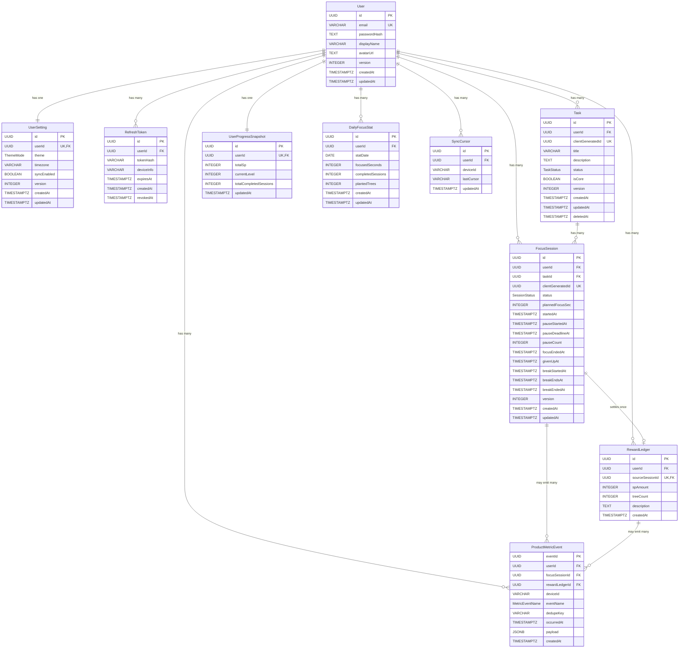

# Focus Forest V1 — 데이터베이스 설계 (db_design)

| 버전 | 날짜 | 작성자 | 변경 내용 |
|------|------|--------|-----------|
| v1.0 | 2026-03-10 | DB-Plan | architecture.md v1.3 기반 DB 설계 분리 |
| v1.1 | 2026-03-10 | DB-Plan | 상위 아키텍처 문서 경로를 docs/03. architecture/architecture.md로 정리 |
| v1.2 | 2026-03-12 | DB-Plan | architecture v2.2 / BE 계약 정렬: enum drift 해소, soft delete, metrics dedupe, timezone, partial unique 기준 확정 |
| v1.3 | 2026-03-12 | DB-Plan | db-rv WARN 반영: metrics 필드 alias, bootstrap session fact 정규화, delete semantics 명시 |
| v1.4 | 2026-03-12 | DB-Plan | RefreshToken 테이블 복원 (cross-doc 정합성 리뷰 반영) |

## 참조 문서

- 상위 아키텍처: `docs/03. architecture/architecture.md`
- 백엔드 설계: `docs/04. be/be_design.md`
- API 명세: `docs/04. be/be_api.md`
- UI 데이터 계약: `docs/02. ui/ui_data_contract.md`
- PRD: `docs/01. po/PRD_FocusForest.md`

---

## 1. 설계 개요

### 1.1 ORM / DBMS

- ORM: Prisma
- DBMS: PostgreSQL

### 1.2 이번 라운드 정렬 원칙

- `Task.status` 저장 enum은 V1에서 `PENDING`, `COMPLETED`만 사용한다. UI의 `진행중` 필터는 활성 `FocusSession` 연결 여부로 파생한다.
- `FocusSession.status`는 `RUNNING`, `PAUSED`, `COMPLETED`, `BREAK_RUNNING`, `BREAK_COMPLETED`, `BREAK_SKIPPED`, `GIVEN_UP`, `GIVEN_UP_TIMEOUT`를 사용한다.
- bootstrap 병합의 권위 있는 dedupe 기준은 `clientGeneratedId`다. 동일 값이 이미 서버에 있으면 서버 row를 채택하고 클라이언트는 ID remap만 수행한다.
- KPI dedupe는 `eventId` 1차 멱등성과 `eventName + dedupeKey` 2차 의미 dedupe를 함께 사용한다.
- `DailyFocusStat.statDate`는 세션 완료 시점의 `UserSetting.timezone` 기준 local date다. timezone 변경 시 과거 row는 재집계하지 않는다.
- 충돌 검출의 권위 있는 필드는 `version`이다. `updatedAt`은 감사/정렬 용도로만 사용한다.

### 1.3 Contract Propagation 요약

| 기준 문서 | DB 파급 포인트 |
|-----------|----------------|
| `architecture.md v2.2` | V1 enum 고정, bootstrap render-ready 범위, metrics dedupe, timezone/backfill 제외 |
| `be_design.md v1.2` | active session partial unique, session 상태/시간 컬럼, Reward/DailyStat/Snapshot 트랜잭션 |
| `be_api.md v1.3` | `TaskStatus=PENDING/COMPLETED`, `FocusSession` 응답 필드명, `ProductMetricEvent` 요청 스키마 |
| `ui_data_contract.md v1.2` | `deletedAt(optional)`, `plannedFocusSec`, `focusEndedAt`, `breakEndsAt`, KPI queue `dedupeKey` |

---

## 2. ERD



---

## 3. ENUM 정의

### 3.1 TaskStatus

```sql
CREATE TYPE "TaskStatus" AS ENUM ('PENDING', 'COMPLETED');
```

- `IN_PROGRESS`는 V1 저장 enum에서 제외한다.
- UI의 `진행중` 필터는 `Task.status`가 아니라 활성 `FocusSession` 존재 여부로 계산한다.

### 3.2 SessionStatus

```sql
CREATE TYPE "SessionStatus" AS ENUM (
  'RUNNING',
  'PAUSED',
  'COMPLETED',
  'BREAK_RUNNING',
  'BREAK_COMPLETED',
  'BREAK_SKIPPED',
  'GIVEN_UP',
  'GIVEN_UP_TIMEOUT'
);
```

### 3.3 ThemeMode

```sql
CREATE TYPE "ThemeMode" AS ENUM ('LIGHT', 'DARK', 'SYSTEM');
```

### 3.4 MetricEventName

```sql
CREATE TYPE "MetricEventName" AS ENUM (
  'APP_FIRST_OPEN',
  'AUTH_SIGNUP_SUCCESS',
  'AUTH_LOGIN_SUCCESS',
  'DASHBOARD_TASK_SET',
  'FOCUS_SESSION_COMPLETED',
  'REWARD_GRANTED_FIRST_TIME'
);
```

---

## 4. 엔터티별 필드 정의

### 4.1 User

| 필드명 | 타입 | Nullable | Default | 제약조건 | 비고 |
|--------|------|----------|---------|----------|------|
| id | UUID | NOT NULL | gen_random_uuid() | PK | 사용자 식별자 |
| email | VARCHAR(255) | NOT NULL | — | UNIQUE | 로그인 계정 |
| passwordHash | TEXT | NOT NULL | — | — | Argon2id 해시 |
| displayName | VARCHAR(24) | NOT NULL | — | — | 프로필 표시명 |
| avatarUrl | TEXT | NULL | — | — | 프로필 이미지 URL |
| version | INTEGER | NOT NULL | 1 | — | 프로필 수정용 낙관적 잠금 |
| createdAt | TIMESTAMPTZ | NOT NULL | now() | — | 생성 시각 |
| updatedAt | TIMESTAMPTZ | NOT NULL | now() | — | 수정 시각 |

> 별도 Profile 테이블은 V1에서 두지 않는다. 프로필 수정 API는 `User.displayName`, `User.avatarUrl`, `User.version`을 사용한다.

### 4.2 UserSetting

| 필드명 | 타입 | Nullable | Default | 제약조건 | 비고 |
|--------|------|----------|---------|----------|------|
| id | UUID | NOT NULL | gen_random_uuid() | PK | 설정 식별자 |
| userId | UUID | NOT NULL | — | UNIQUE, FK → User(id) | 사용자당 1개 |
| theme | ThemeMode ENUM | NOT NULL | 'SYSTEM' | — | 테마 |
| timezone | VARCHAR(100) | NOT NULL | 'Asia/Seoul' | — | IANA 타임존 |
| syncEnabled | BOOLEAN | NOT NULL | true | — | 동기화 사용 여부 |
| version | INTEGER | NOT NULL | 1 | — | 설정 수정용 낙관적 잠금 |
| createdAt | TIMESTAMPTZ | NOT NULL | now() | — | 생성 시각 |
| updatedAt | TIMESTAMPTZ | NOT NULL | now() | — | 수정 시각 |

### 4.3 RefreshToken

| 필드명 | 타입 | Nullable | Default | 제약조건 | 비고 |
|--------|------|----------|---------|----------|------|
| id | UUID | NOT NULL | gen_random_uuid() | PK | 토큰 식별자 |
| userId | UUID | NOT NULL | — | FK → User(id) | 소유 사용자 |
| tokenHash | VARCHAR(255) | NOT NULL | — | — | refresh token 해시값. 원문 저장 금지 |
| deviceInfo | VARCHAR(255) | NULL | — | — | 디바이스 식별 정보 |
| expiresAt | TIMESTAMPTZ | NOT NULL | — | — | 토큰 만료 시각 |
| createdAt | TIMESTAMPTZ | NOT NULL | now() | — | 발급 시각 |
| revokedAt | TIMESTAMPTZ | NULL | — | — | 폐기 시각. `NULL`이면 유효 |

**정책**

- `POST /api/v1/auth/refresh` 성공 시 새 refresh token을 발급하고, 직전 유효 token row는 즉시 `revokedAt`을 기록해 rotation/revocation을 남긴다.
- refresh token은 원문을 저장하지 않고 `tokenHash` 또는 안전한 메타데이터만 저장한다.
- 로그아웃/강제 폐기 시 현재 유효 token row의 `revokedAt`을 기록한다.
- 운영 환경에서는 Redis를 refresh token 저장/회전/폐기 coordination에 사용하더라도, 영속 저장소인 이 테이블을 인메모리로 대체하지 않는다.

### 4.4 Task

| 필드명 | 타입 | Nullable | Default | 제약조건 | 비고 |
|--------|------|----------|---------|----------|------|
| id | UUID | NOT NULL | gen_random_uuid() | PK | Task 식별자 |
| userId | UUID | NOT NULL | — | FK → User(id) | 소유자 |
| clientGeneratedId | UUID | NULL | — | UNIQUE | bootstrap 병합 dedupe 키 |
| title | VARCHAR(120) | NOT NULL | — | — | 제목 |
| description | TEXT | NULL | — | — | 설명 |
| status | TaskStatus ENUM | NOT NULL | 'PENDING' | — | V1 허용값: `PENDING`, `COMPLETED` |
| isCore | BOOLEAN | NOT NULL | false | — | 핵심 과제 여부 |
| version | INTEGER | NOT NULL | 1 | — | 낙관적 잠금 |
| createdAt | TIMESTAMPTZ | NOT NULL | now() | — | 생성 시각 |
| updatedAt | TIMESTAMPTZ | NOT NULL | now() | — | 수정 시각 |
| deletedAt | TIMESTAMPTZ | NULL | — | — | soft delete 시각 |

**정책**

- `DELETE /tasks/:taskId`는 physical delete 대신 `deletedAt`을 채우는 soft delete로 처리하고, 성공 응답은 `deletedTaskId`, `deletedAt`을 반환한다.
- bootstrap dedupe는 soft-deleted row까지 포함해 `clientGeneratedId` 기준으로 처리한다.
- 완료된 Task는 핵심 과제로 유지하지 않는다. DB에서는 `NOT (isCore = true AND status = 'COMPLETED')` check로 보호한다.

### 4.5 FocusSession

| 필드명 | 타입 | Nullable | Default | 제약조건 | 비고 |
|--------|------|----------|---------|----------|------|
| id | UUID | NOT NULL | gen_random_uuid() | PK | 세션 식별자 |
| userId | UUID | NOT NULL | — | FK → User(id) | 소유자 |
| taskId | UUID | NOT NULL | — | FK → Task(id) | 연결 Task |
| clientGeneratedId | UUID | NULL | — | UNIQUE | bootstrap 병합 dedupe 키 |
| status | SessionStatus ENUM | NOT NULL | 'RUNNING' | — | 세션 상태 |
| plannedFocusSec | INTEGER | NOT NULL | 1500 | CHECK (`plannedFocusSec > 0`) | 계획 집중 시간 |
| startedAt | TIMESTAMPTZ | NOT NULL | now() | — | 집중 시작 시각 |
| pauseStartedAt | TIMESTAMPTZ | NULL | — | — | pause 시작 시각 |
| pauseDeadlineAt | TIMESTAMPTZ | NULL | — | — | pause 만료 시각 |
| pauseCount | INTEGER | NOT NULL | 0 | CHECK (`pauseCount BETWEEN 0 AND 1`) | V1 최대 1회 |
| focusEndedAt | TIMESTAMPTZ | NULL | — | — | 집중 완료 시각 |
| givenUpAt | TIMESTAMPTZ | NULL | — | — | 포기 시각 |
| breakStartedAt | TIMESTAMPTZ | NULL | — | — | break 시작 시각 |
| breakEndsAt | TIMESTAMPTZ | NULL | — | — | break 종료 예정 시각 |
| breakEndedAt | TIMESTAMPTZ | NULL | — | — | break 실제 종료 시각 |
| version | INTEGER | NOT NULL | 1 | — | 상태 전이용 낙관적 잠금 |
| createdAt | TIMESTAMPTZ | NOT NULL | now() | — | 생성 시각 |
| updatedAt | TIMESTAMPTZ | NOT NULL | now() | — | 수정 시각 |

**상태/필드 정렬**

- `COMPLETED`는 집중 종료를 의미하며 `focusEndedAt`을 기록한다.
- `BREAK_RUNNING`은 별도 엔터티가 아니라 동일 row에서 관리한다.
- `BREAK_COMPLETED`, `BREAK_SKIPPED`는 `breakEndedAt`을 기록한다.
- `GIVEN_UP`, `GIVEN_UP_TIMEOUT`은 `givenUpAt`을 기록한다.
- 활성 세션 판정 상태는 `RUNNING`, `PAUSED`, `BREAK_RUNNING`이다.

### 4.6 RewardLedger

| 필드명 | 타입 | Nullable | Default | 제약조건 | 비고 |
|--------|------|----------|---------|----------|------|
| id | UUID | NOT NULL | gen_random_uuid() | PK | 보상 기록 식별자 |
| userId | UUID | NOT NULL | — | FK → User(id) | 수령자 |
| sourceSessionId | UUID | NOT NULL | — | UNIQUE, FK → FocusSession(id) | 세션당 1회 정산 |
| spAmount | INTEGER | NOT NULL | — | CHECK (`spAmount > 0`) | 지급 SP |
| treeCount | INTEGER | NOT NULL | 1 | CHECK (`treeCount > 0`) | 지급 나무 수 |
| description | TEXT | NULL | — | — | 보상 사유 메모 |
| createdAt | TIMESTAMPTZ | NOT NULL | now() | — | 생성 시각 |

> append-only 테이블이다. 수정/삭제 대신 보정 row를 추가한다.

### 4.7 UserProgressSnapshot

| 필드명 | 타입 | Nullable | Default | 제약조건 | 비고 |
|--------|------|----------|---------|----------|------|
| id | UUID | NOT NULL | gen_random_uuid() | PK | 스냅샷 식별자 |
| userId | UUID | NOT NULL | — | UNIQUE, FK → User(id) | 사용자당 1개 |
| totalSp | INTEGER | NOT NULL | 0 | CHECK (`totalSp >= 0`) | 누적 SP |
| currentLevel | INTEGER | NOT NULL | 1 | CHECK (`currentLevel >= 1`) | 현재 레벨 |
| totalCompletedSessions | INTEGER | NOT NULL | 0 | CHECK (`totalCompletedSessions >= 0`) | 총 완료 세션 수 |
| updatedAt | TIMESTAMPTZ | NOT NULL | now() | — | 마지막 갱신 시각 |

> `currentStreak`는 V1 범위 밖이므로 컬럼을 두지 않는다.

### 4.8 DailyFocusStat

| 필드명 | 타입 | Nullable | Default | 제약조건 | 비고 |
|--------|------|----------|---------|----------|------|
| id | UUID | NOT NULL | gen_random_uuid() | PK | 일별 통계 식별자 |
| userId | UUID | NOT NULL | — | FK → User(id) | 소유자 |
| statDate | DATE | NOT NULL | — | UNIQUE (`userId`, `statDate`) | 사용자 local date |
| focusedSeconds | INTEGER | NOT NULL | 0 | CHECK (`focusedSeconds >= 0`) | 일간 집중 시간 |
| completedSessions | INTEGER | NOT NULL | 0 | CHECK (`completedSessions >= 0`) | 일간 완료 세션 수 |
| plantedTrees | INTEGER | NOT NULL | 0 | CHECK (`plantedTrees >= 0`) | 일간 식재 수 |
| createdAt | TIMESTAMPTZ | NOT NULL | now() | — | 생성 시각 |
| updatedAt | TIMESTAMPTZ | NOT NULL | now() | — | 수정 시각 |

**day-boundary 정책**

- `statDate`는 세션 완료 시점의 `UserSetting.timezone`으로 계산한 local date다.
- timezone 변경 시 과거 row는 rewrite/backfill하지 않는다.
- 변경 이후 완료되는 세션부터 새 timezone 기준을 적용한다.
- 따라서 일일 리셋은 cron보다 `userId + statDate` 조회 규칙으로 해결한다.

### 4.9 ProductMetricEvent

| 필드명 | 타입 | Nullable | Default | 제약조건 | 비고 |
|--------|------|----------|---------|----------|------|
| eventId | UUID | NOT NULL | — | PK | 전송 멱등성 키 |
| userId | UUID | NULL | — | FK → User(id) | 로그인 이벤트 소유자 |
| focusSessionId | UUID | NULL | — | FK → FocusSession(id) | 세션 관련 KPI |
| rewardLedgerId | UUID | NULL | — | FK → RewardLedger(id) | 보상 관련 KPI. API DTO의 `rewardGrantId` semantic field를 영속 계층에서 매핑한 컬럼 |
| deviceId | VARCHAR(255) | NOT NULL | — | — | 익명/로그인 공통 device scope |
| eventName | MetricEventName ENUM | NOT NULL | — | — | KPI 이벤트명 |
| dedupeKey | VARCHAR(255) | NULL | — | — | 의미 dedupe 키 |
| occurredAt | TIMESTAMPTZ | NOT NULL | — | — | 실제 발생 시각 |
| payload | JSONB | NULL | — | — | 부가 데이터 |
| createdAt | TIMESTAMPTZ | NOT NULL | now() | — | 적재 시각 |

**dedupe 정책**

- 1차 보호: `eventId` PK
- 2차 보호: `UNIQUE (eventName, dedupeKey) WHERE dedupeKey IS NOT NULL`
- `AUTH_LOGIN_SUCCESS`, `DASHBOARD_TASK_SET`은 dedupeKey 없이 `eventId`만으로 중복 제거한다.
- `APP_FIRST_OPEN`, `AUTH_SIGNUP_SUCCESS`, `FOCUS_SESSION_COMPLETED`, `REWARD_GRANTED_FIRST_TIME`는 고정 dedupeKey를 사용한다.

### 4.10 SyncCursor

| 필드명 | 타입 | Nullable | Default | 제약조건 | 비고 |
|--------|------|----------|---------|----------|------|
| id | UUID | NOT NULL | gen_random_uuid() | PK | 커서 식별자 |
| userId | UUID | NOT NULL | — | FK → User(id) | 소유자 |
| deviceId | VARCHAR(255) | NOT NULL | — | UNIQUE (`userId`, `deviceId`) | 디바이스 식별자 |
| lastCursor | VARCHAR(255) | NOT NULL | — | — | pull 기준 커서 문자열 |
| updatedAt | TIMESTAMPTZ | NOT NULL | now() | — | 갱신 시각 |

---

## 5. 핵심 제약 및 인덱스

### 5.1 Unique / Partial Unique

```sql
CREATE UNIQUE INDEX "uq_task_client_generated_id"
ON "Task" ("clientGeneratedId")
WHERE "clientGeneratedId" IS NOT NULL;

CREATE UNIQUE INDEX "uq_focus_session_client_generated_id"
ON "FocusSession" ("clientGeneratedId")
WHERE "clientGeneratedId" IS NOT NULL;

CREATE UNIQUE INDEX "uq_task_user_core_active"
ON "Task" ("userId")
WHERE "isCore" = true AND "deletedAt" IS NULL;

CREATE UNIQUE INDEX "uq_focus_session_user_active"
ON "FocusSession" ("userId")
WHERE "status" IN ('RUNNING', 'PAUSED', 'BREAK_RUNNING');

CREATE UNIQUE INDEX "uq_daily_focus_stat_user_date"
ON "DailyFocusStat" ("userId", "statDate");

CREATE UNIQUE INDEX "uq_metric_event_name_dedupe_key"
ON "ProductMetricEvent" ("eventName", "dedupeKey")
WHERE "dedupeKey" IS NOT NULL;

CREATE UNIQUE INDEX "uq_sync_cursor_user_device"
ON "SyncCursor" ("userId", "deviceId");
```

### 5.2 조회 인덱스

| 인덱스 | 대상 | 사용 시나리오 |
|--------|------|---------------|
| `idx_task_user_visible_updated` | `Task(userId, status, updatedAt DESC) WHERE deletedAt IS NULL` | 대시보드 Task 목록 |
| `idx_focus_session_user_status_pause` | `FocusSession(userId, status, pauseDeadlineAt)` | active session 조회, pause timeout sweeper |
| `idx_refresh_token_user` | `RefreshToken(userId)` | 사용자별 토큰 조회, 일괄 폐기 |
| `idx_refresh_token_expires_active` | `RefreshToken(expiresAt) WHERE revokedAt IS NULL` | 유효 토큰 만료 정리 배치용 (선택) |
| `idx_reward_ledger_user_created` | `RewardLedger(userId, createdAt DESC)` | 보상 원장 조회 |
| `idx_daily_focus_stat_user_date` | `DailyFocusStat(userId, statDate)` | 오늘 통계 조회 |
| `idx_metric_event_name_occurred` | `ProductMetricEvent(eventName, occurredAt DESC)` | KPI 집계 |
| `idx_metric_event_user_occurred` | `ProductMetricEvent(userId, occurredAt DESC)` | 로그인 사용자 KPI 조회 |
| `idx_metric_event_device_occurred` | `ProductMetricEvent(deviceId, occurredAt DESC)` | 익명 device 기준 조회/감사 |

### 5.3 Check 제약

- `chk_task_core_not_completed`: `NOT ("isCore" = true AND "status" = 'COMPLETED')`
- `chk_focus_session_pause_count`: `"pauseCount" BETWEEN 0 AND 1`
- `chk_reward_ledger_positive`: `"spAmount" > 0 AND "treeCount" > 0`
- `chk_daily_focus_stat_non_negative`: `focusedSeconds`, `completedSessions`, `plantedTrees` 모두 0 이상

---

## 6. 트랜잭션 및 병합 정책

### 6.1 세션 완료 트랜잭션

세션 완료 시 아래 4개 쓰기를 하나의 트랜잭션으로 묶는다.

| 순서 | 테이블 | 작업 |
|------|--------|------|
| 1 | `FocusSession` | `status='COMPLETED'`, `focusEndedAt` 기록, `version + 1` |
| 2 | `RewardLedger` | 보상 row INSERT (`sourceSessionId UNIQUE`) |
| 3 | `DailyFocusStat` | `focusedSeconds`, `completedSessions`, `plantedTrees` UPSERT 증가 |
| 4 | `UserProgressSnapshot` | `totalSp`, `currentLevel`, `totalCompletedSessions` 갱신 |

- 어느 단계든 실패하면 전체 롤백한다.
- break 전이는 `FocusSession` 단일 row 갱신이며, 보상/통계 row를 다시 갱신하지 않는다.

### 6.2 bootstrap 병합

- Task / FocusSession의 bootstrap dedupe 기준은 `clientGeneratedId`다.
- 동일 `clientGeneratedId`가 이미 서버에 존재하면 INSERT 대신 기존 row를 채택한다.
- bootstrap의 `SessionFactInput.endedAt`은 transport alias이며, 영속화 시 `status` 기준으로 `focusEndedAt`, `givenUpAt`, `breakEndedAt` 중 하나로 정규화한다.
- soft-deleted Task도 기존 row로 간주한다. 중복 INSERT로 resurrect하지 않는다.
- 로컬 집계값(`총 SP`, `레벨`, `오늘의 나무`)은 bootstrap으로 직접 반영하지 않는다.

### 6.3 version 정책

| 엔터티 | version 사용 목적 |
|--------|-------------------|
| `User` | 프로필 수정 충돌 검출 |
| `UserSetting` | 설정 수정 충돌 검출 |
| `Task` | 제목/상태/핵심 과제/삭제 충돌 검출 |
| `FocusSession` | pause/resume/complete/give-up/break 전이 충돌 검출 |

---

## 7. 삭제 및 보존 정책

- `Task`만 soft delete를 사용한다. 기본 조회와 핵심 과제 partial unique는 `deletedAt IS NULL` 기준으로 동작한다.
- `FocusSession`, `RewardLedger`, `ProductMetricEvent`는 이력 보존이 필요한 append-only/immutable 성격이므로 V1에서 soft delete를 두지 않는다.
- `RewardLedger`, `ProductMetricEvent`는 운영 보정이 필요할 때 기존 row 수정 대신 보정 row 추가 또는 상위 서비스 보정 로직으로 처리한다.

---

## 8. V1 제외 범위

- `TaskStatus.IN_PROGRESS` 등 추가 저장 enum
- `currentStreak` 저장/응답/재집계
- timezone 변경 시 과거 `DailyFocusStat` historical rewrite/backfill
- bootstrap 응답에 reward ledger/history 전체 포함
- metrics 고급 분석용 별도 차원 테이블
